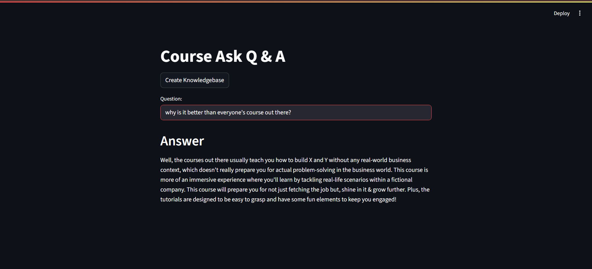
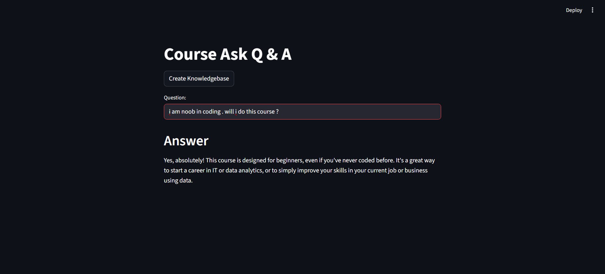
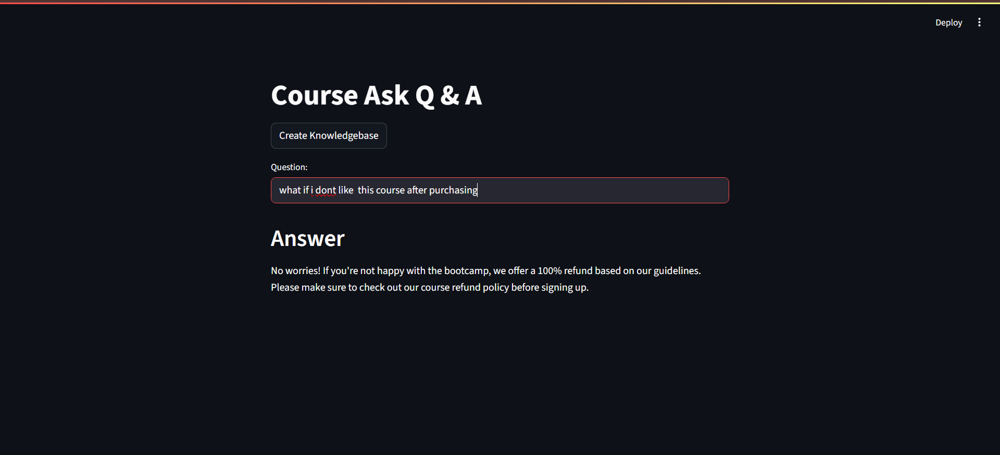

# 🤖 Gemini FAQ Bot — AI-Powered Course Assistant

A powerful AI chatbot built using **LangChain**, **Google Gemini**, **Instructor Embeddings**, and **Streamlit**, designed to answer user questions based on a custom FAQ knowledge base (CSV format). This bot retrieves and rephrases answers in a natural, friendly way — perfect for educational platforms, ed-tech products, or course inquiry assistants.

---

## 🚀 Features

- 💡 Uses **Gemini Flash (via LangChain)** for fast, friendly answers  
- 📚 Loads questions from a custom **CSV FAQ file**  
- 🔍 Employs **FAISS vector search** + **Instructor Embeddings** for semantic retrieval  
- ✍️ Rephrases answers naturally with a prompt-guided approach  
- 🔐 API key stored securely via `.env` (not committed)  
- 🖥️ Clean and interactive **Streamlit UI**

---

## 💬 Chatbot in Action (Multiple Questions)


---




---




---




---


## 🛠️ Tech Stack

| Component            | Tool                                      |
|----------------------|-------------------------------------------|
| LLM                  | Google Gemini 2.0 Flash (`gemini-2.0-flash`) |
| Framework            | LangChain                                 |
| Embeddings           | `hkunlp/instructor-large` (HuggingFace)   |
| Vector DB            | FAISS                                     |
| UI                   | Streamlit                                 |
| API Management       | python-dotenv                             |

---

## 📁 Project Structure

```
├── app.py                  # Streamlit frontend
├── langchain_helper.py     # Vector DB & Gemini QA logic
├── faqs.csv                # FAQ knowledge base (input CSV)
├── .env                    # API key storage (not committed)
├── requirements.txt        # All dependencies
├── .gitignore              # Files to ignore (env, cache, etc.)
├── README.md               # Project documentation
```

---

## 🔧 Setup Instructions

### 1. Clone the Repository

```bash

git clone https://github.com/hendrix-04/-FAQ-Bot-AI-Powered-Course-Assistant

cd gemini-faq-bot
```

### 2. Create a `.env` File

```env
GOOGLE_API_KEY=your-google-api-key-here
```

> 🔑 Get your Gemini API key from: https://makersuite.google.com/app/apikey

### 3. Install Dependencies

```bash
pip install -r requirements.txt
```

### 4. Run the App

```bash
streamlit run app.py
```

---

## 🔐 Security Notes

- API keys are stored in `.env` (not committed to GitHub)
- `.env` is listed in `.gitignore` to prevent accidental uploads

---

## 📌 To-Do / Future Enhancements

- [ ] Add PDF and website loading support  
- [ ] Deploy to Streamlit Cloud or Hugging Face Spaces  
- [ ] Add memory for follow-up questions  
- [ ] Customize themes and branding in UI  

---


---

> Made with ❤️ using LangChain + Gemini + HuggingFace + Streamlit
